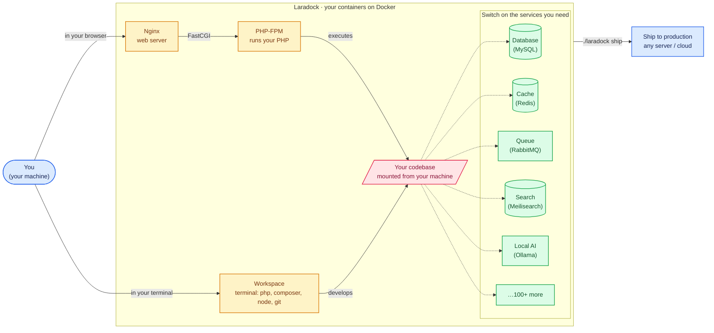
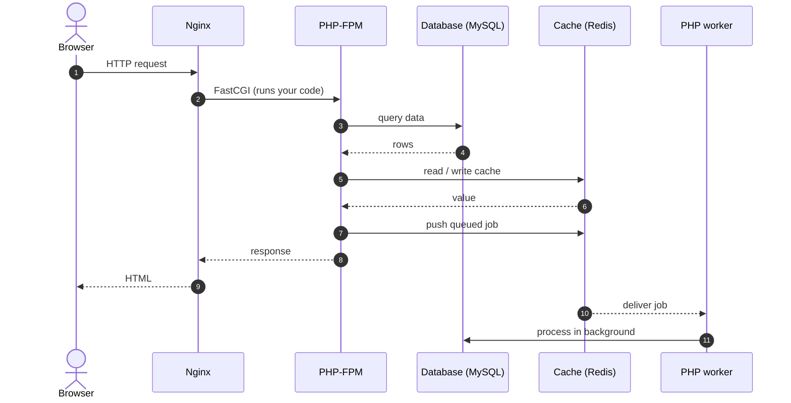
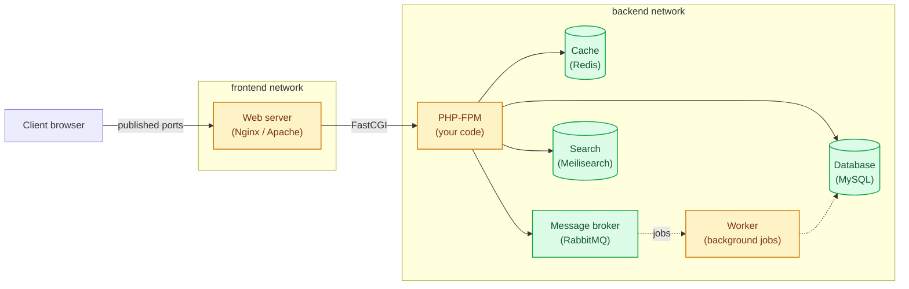

# Getting Started

Source: https://laradock.io/docs/getting-started

This guide gets Laradock running for your project. The fastest path is the **Laradock CLI**, a short wizard that sets everything up for you, so start there. If you would rather wire things up by hand with plain `docker compose`, see [Manual setup](https://laradock.io/docs/manual-setup), it is meant for advanced users who want full control.

{/* SYNC: keep this tip identical in docs/Intro.md and docs/getting-started.md */}
:::tip[Let AI use it]
Three ways to point your AI assistant at Laradock:

- **Run it for you** - the repo ships agent instructions ([`AGENTS.md`](https://github.com/laradock/laradock/blob/master/AGENTS.md) + rule files for [Claude Code](https://claude.com/claude-code), [Gemini CLI](https://github.com/google-gemini/gemini-cli), [Cursor](https://cursor.com), [Cline](https://cline.bot), and [Windsurf](https://windsurf.com)). Open the repo in your agent and say *"Set up Laradock for this project."*
- **Ask about it, no clone** - add the docs as an MCP server: `https://gitmcp.io/laradock/laradock`.
- **Read a walkthrough** - browse the AI-generated overview on [DeepWiki](https://deepwiki.com/laradock/laradock), starting with its [architecture diagram](https://deepwiki.com/laradock/laradock/1-overview-of-laradock#system-architecture).
:::

**Building something specific?** Jump straight to a guide tailored to the most popular platforms:

<div className="install-grid">
  <a href="/docs/laravel-on-docker">Laravel</a>
  <a href="/docs/wordpress-on-docker">WordPress</a>
  <a href="/docs/symfony-on-docker">Symfony</a>
  <a href="/docs/drupal-on-docker">Drupal</a>
  <a href="/docs/magento-on-docker">Magento</a>
  <a href="/docs/woocommerce-on-docker">WooCommerce</a>
  <a href="/docs/moodle-on-docker">Moodle</a>
  <a href="/docs/codeigniter-on-docker">CodeIgniter</a>
  <a href="/docs/nextcloud-on-docker">Nextcloud</a>
  <a href="/docs/prestashop-on-docker">PrestaShop</a>
</div>

Not one of these? Browse the [full list of 100+ supported projects](https://laradock.io/docs/Intro#supported-php-projects), then follow its guide. Otherwise the generic steps below work for any PHP app.

## Requirements

- [Git](https://git-scm.com/downloads)
- [Docker](https://www.docker.com/products/docker-desktop/) (with Docker Compose v2.20 or newer)

## Get started with CLI {#get-started}

1 - Clone Laradock inside your PHP project (or anywhere, if you don't have one yet):

```bash
git clone https://github.com/laradock/laradock.git
cd laradock
```

2 - Start your stack:

```bash
./laradock start
```

On the **first run**, `start` walks you through a short setup wizard: it detects your framework and lets you pick your project, PHP version, and services (web server, database, cache), everything pre-answered, then points your app's `.env` at those services, starts the stack, and prints its URLs and credentials. After that, `./laradock start` just starts and reprints them. Re-run the wizard any time with `./laradock setup`.

3 - Enter the workspace, a dev shell with `php`, `composer`, `node`, and `git` inside:

```bash
./laradock workspace
```

4 - Open [http://localhost](http://localhost). Done.

:::tip[Where do I run `artisan`, `composer`, `npm`?]
Inside the workspace container, not on your machine. Enter it once with `./laradock workspace` and run commands from there, or prefix a single one: `./laradock exec workspace php artisan migrate`.
:::

The CLI hides nothing: it prints every real `docker compose` command it runs, keeps no state, and only ever writes your `.env`. Unknown commands pass straight through (`./laradock logs -f nginx` runs `docker compose logs -f nginx`). Full reference: [The Laradock CLI](https://laradock.io/docs/cli).

## How it works

### The stack

Here is the whole picture from where you sit. You work two ways: open your app in a **browser** (Nginx serves it through PHP-FPM), or drop into the **Workspace** terminal to run `artisan`, `composer`, `npm`. Both act on the **same codebase**, mounted straight from your machine. Your code talks to whatever **services** you switch on, add as many as you need, and the same setup ships to production. Click any node to open its source.



Solid arrows are how you drive it; dashed arrows are the optional services your code uses. Each service is its own container, switch them on and off per project and they never conflict, and add as many as you like from the [100+ available](https://laradock.io/docs/Intro#supported-services).

### How Laradock configuration works

- Your `.env` (created on first run, or `cp .env.example .env` by hand) holds the **shared settings**: paths, PHP version, project name.
- Each service keeps its **own settings** pre-filled in its folder: `mysql/defaults.env`, `nginx/defaults.env`, and so on. You never need to copy or edit those files, they work out of the box.
- To change **any** setting, shared or per-service, add that line to your `.env` with your value. **Your `.env` always wins over every `defaults.env`.** For example, to run MySQL on another port, add `MYSQL_PORT=3307` to your `.env`.
- To discover what a service lets you configure, open its folder's `defaults.env`, it's a short, readable list.
- **Upgrading from an older Laradock?** Your existing full `.env` keeps working exactly as before, no changes needed.

:::warning One exception: database passwords are set on first run only
`MYSQL_PASSWORD`, `POSTGRES_PASSWORD`, and the other database credentials are applied the **first time** that database starts, when it creates its data files on disk. Changing them in `.env` later (even with `./laradock rebuild`) does **not** update an existing database; the old password keeps working. To change a database password for real, either run the change inside the database itself (for example `ALTER USER`), or delete that service's data folder under `DATA_PATH_HOST` so it initializes fresh (this erases that database's data).
:::

### How a request flows

Here is what actually happens when a browser hits your app: Nginx hands the request to PHP-FPM, which runs your code and talks to whichever services you enabled, then hands the response back. Anything you queue is passed to the worker and finishes in the background.



The database and cache here are whatever you enabled (Postgres, Valkey, and so on): the shape stays the same.

### How the repository is organized

One folder per service, and everything about a service lives in its folder:

```
laradock/
├── docker-compose.yml      # the service catalog: shared networks/volumes + include list
├── .env.example            # shared settings template (copy to .env)
├── mysql/
│   ├── compose.yml         # mysql's container definition
│   ├── defaults.env        # mysql's settings, pre-filled
│   └── Dockerfile          # mysql's image
├── nginx/
│   ├── compose.yml
│   ├── defaults.env
│   ├── Dockerfile
│   └── sites/              # your site configs
└── ...                     # ~100 more services, same pattern
```

So when you want to:

| You want to... | Edit... |
|---|---|
| Change any setting (port, version, password, flag) | your `.env` (add one line, it wins) |
| See what a service lets you configure | `<service>/defaults.env` (read-only for you) |
| Change a container's structure (mounts, links, ...) | `<service>/compose.yml` |
| Change how an image is built | `<service>/Dockerfile`, then rebuild |

The root `docker-compose.yml` pulls every service in via Compose `include`, which requires Docker Compose v2.20 or newer. Every top-level folder in the repo is a runnable container, so the folder list is always the up-to-date list of [available services](https://laradock.io/docs/Intro#supported-services).

### How networking works

Containers sit on two Docker networks. The **web server** faces the outside on the `frontend` network; **everything else** (PHP-FPM, your database, cache, queue, search, and the background worker) lives on the `backend` network, out of reach from outside. The web server bridges the two so it can pass requests through to PHP-FPM.



The browser reaches the web server through **published ports**, not a Docker network. Switch the driver for both networks with `NETWORKS_DRIVER` in your `.env`. More: [Networking](https://laradock.io/docs/networking).

## Running multiple projects

One Laradock can serve one project, or many. Run an **isolated** Laradock per project (separate containers and data), or serve **several sites from one** Laradock with a web-server config each. Different PHP versions per project are supported too.

→ Full guide: [Running Multiple Projects](https://laradock.io/docs/multiple-projects) · [Multiple PHP Versions](https://laradock.io/docs/multiple-php-versions)

## Manual setup (advanced, full control) {#manual-setup}

Rather wire things up by hand? Everything the CLI does, you can do with plain `docker compose`, same files, same result. It's the path for advanced users who want full control over exactly which containers run and how they're configured.

→ Full guide: [Manual Setup (without the CLI)](https://laradock.io/docs/manual-setup)
